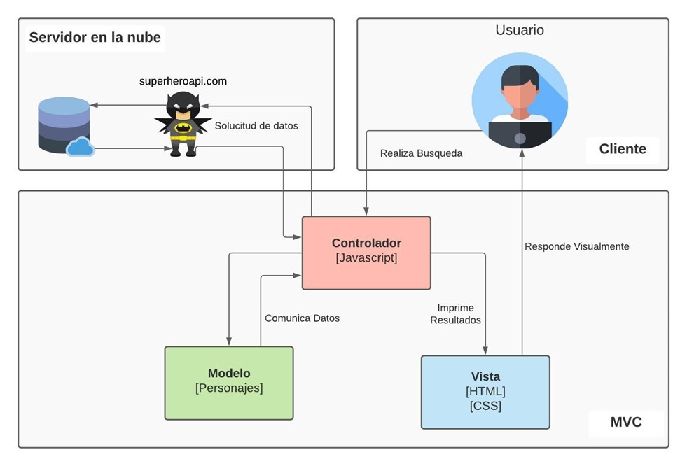
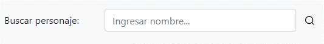
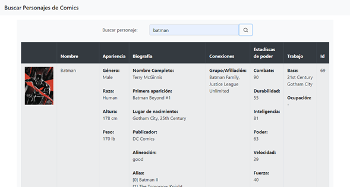
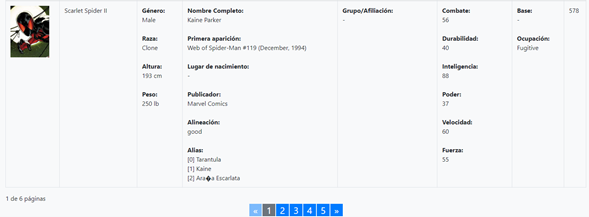
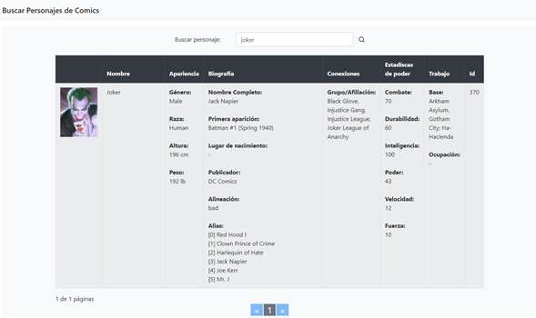
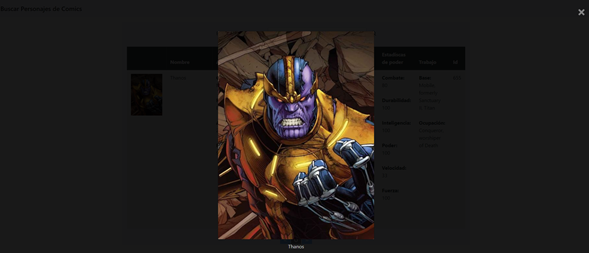

> # PRÁCTICA DE LABORATORIO 

**CARRERA:** Computación

**ASIGNATURA:** Plataformas Web

**NRO. PRÁCTICA:**	1	

**TÍTULO PRÁCTICA:** Desarrollo de una aplicación web utilizando la API.

**OBJETIVO ALCANZADO:** 
- Conocer las arquitecturas y patrones arquitectónicos web para el diseño de aplicaciones web.
- Interactuar con servicios web de plataformas en la nube.

> ## ACTIVIDADES DESARROLLADAS

1. **Identificar gráficamente la arquitectura y el patrón de diseño de la aplicación a desarrollar.**

**Íconos diseñados por:**  
Autor: Freepik 
Enlace: www.flaticon.es  
Autor: Roundicons 
Enlace: https://www.flaticon.es/autores/roundicons  
Autor: Smashicons 
Enlace: https://www.flaticon.es/autores/smashicons 

2. **Generar una llave para consumir los servicios web de la API (opcional, depende de la API seleccionada).**

La API seleccionada es https://superheroapi.com/ . Para poder utilizarla y obtener el access-tocken se tuvo que registrar con una cuanta de Facebook. La cual, de acuerdo con su página web oficial, es una fuente de datos cuantificada y accesible mediante programación de todos los superhéroes del universo del cómic.

3. **Crear un repositorio en GitHub con el nombre “Practica00 – Consumo de APIs en la nube”.**

Se creó el repositorio en Github:

Usuario: czhizhpon 
Enlace: https://github.com/czhizhpon/Practica00-ConsumodeAPIsenlanube

4. **Desarrollar una aplicación con HTML + CSS + Javascript + Web Services para buscar información y visualizar toda la información disponible a través de la API.**

- La aplicación Web debe permitir buscar la información a través de un nombre.

Se realizó un formulario con un input tipo search y un input tipo button con forma de lupa para realizar la búsqueda de un personaje, como se puede ver en la siguiente imagen.

 

- Además, se deberá visualizar toda la información disponible de la base de datos. 

Al realizar la búsqueda con el nombre de un personaje, se muestra la información de una tabla, resaltando la categoría en negrita para categorizar la información y que sea lo mejor legible para el lector. Esto se puede observar en la siguiente imagen.

- También, la aplicación deberá aplicar paginación en caso de la búsqueda del primer requerimiento. Es decir, si la búsqueda retorna más de 5 resultados se deberá paginar los mismos según el total de resultados obtenidos.

Para mayor legibilidad de la información, y para que no abunde o cause confusión en el lector, se optó por dividir en páginas de 2 personajes por cada una. También, se optó por mostrar un máximo de 5 páginas para avanzar o retroceder la información, esto con la finalidad de no aparezca una fila abundante de números y no incomode a la vista.

 

- Por último, la interfaz gráfica aplicada debe ser intuitiva y sencilla aplicando conceptos de experiencia de usuario.

Se optó por usar colores claros para dar mayor realce a la información y mejorar la experiencia de usuario con los puntos anteriores explicados.

Además, el usuario puede dar clic en la imagen para poder observarla mejor, además de que no sale del entorno de la aplicación, como se puede ver en la siguiente imagen.

 
> ## RESULTADO(S) OBTENIDO(S):
Se profundizó las arquitecturas y patrones arquitectónicos web para el diseño de aplicaciones web. Además, se logró interactuar con servicios web de plataformas en la nube, para la creación de un sitio Web que permita la lectura y presentación de información.

> ## CONCLUSIONES:
Las arquitecturas y patrones web son una parte fundamental en el diseño y desarrollo de un proyecto web. Ya que, permite conocer a mayor profundidad el funcionamiento de los elementos que están relacionados al momento de crear dichas páginas web. Además, de aplicar buenas prácticas para que la vista de la información hacia el usuario sea algo primordial y optimizado.

> ## RECOMENDACIONES:
Usar la versión 4 de Bootstrap. 

**Nombre de estudiante:** Zhizhpon Tacuri Cesar Eduardo. 

